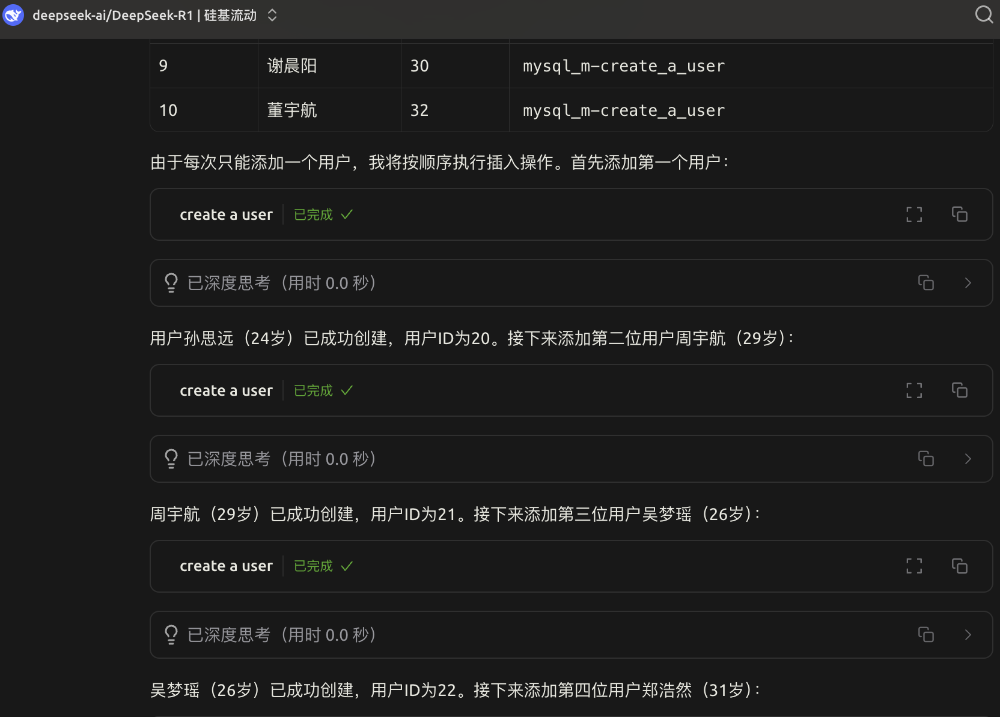

# mcp-mysql demo

# table

- user
  - name
  - age
  - Id:  auto increase
- group
  - name
  - id: auto increase

# tool

- User
  - create a user
  - search all user
  - search a user

- Group
  - create a group
  - search all group
  - search a group
- table
  - get all tables

# demo

- create users

